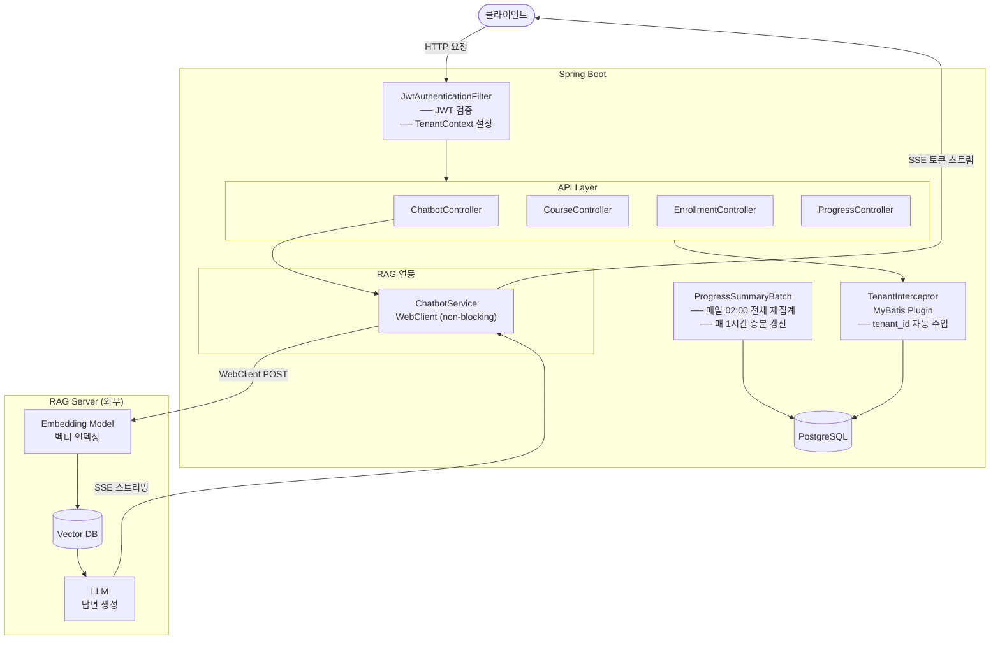

# LearnFlow — 학습용 LMS 백엔드

> RAG 기반 챗봇 + 멀티 테넌트 데이터 격리를 직접 구현해보며 공부한 Spring Boot 백엔드 프로젝트입니다.

---

## 아키텍처



---

## 왜 만들었나

RAG(Retrieval-Augmented Generation) 구조를 실제 서비스 흐름에 녹여보고 싶었습니다.  
단순 API 호출 수준이 아니라, **DB 데이터를 벡터 인덱싱하고 SSE로 스트리밍 응답**을 받는 흐름을 Spring WebFlux와 함께 직접 연결해봤습니다.  
멀티 테넌트 격리, RBAC 권한 체계는 LMS 도메인을 빌려 함께 실습했습니다.

---

## 기술 스택

| 영역 | 기술 |
|---|---|
| Language | Java 17 |
| Framework | Spring Boot 3.2, Spring Security 6 |
| Persistence | MyBatis 3, PostgreSQL |
| Reactive | Spring WebFlux (WebClient, SSE) |
| Auth | JWT (jjwt 0.12) |
| Build | Gradle |

---

## 핵심 구현 — RAG 챗봇

### 전체 흐름

```
클라이언트
  └─ POST /api/chatbot/stream (질문 + 대화 히스토리)
        └─ ChatbotService
              └─ WebClient → RAG 서버 /chat/stream
                    └─ SSE 토큰 스트리밍 → 클라이언트로 실시간 전달
```

### 1. SSE 스트리밍 응답

RAG 서버에서 답변을 토큰 단위로 받아 클라이언트에 실시간으로 흘려줍니다.

```java
// ChatbotService.java
return ragWebClient.post()
        .uri("/chat/stream")
        .bodyValue(body)
        .retrieve()
        .bodyToFlux(new ParameterizedTypeReference<ServerSentEvent<String>>() {})
        .filter(event -> event.data() != null && !event.data().equals("[DONE]"))
        .map(ServerSentEvent::data);
```

- `WebClient`로 RAG 서버와 논블로킹 연결
- `[DONE]` 이벤트 필터링으로 스트림 종료 처리
- 응답 완료 시간 로깅으로 레이턴시 측정 (`doOnComplete`)

### 2. DB 테이블 벡터 인덱싱

강좌·진도 같은 DB 데이터를 RAG 서버에 인덱싱해 질문 컨텍스트로 활용합니다.

```http
POST /api/chatbot/index-db
{
  "tableName":   "courses",
  "textColumns": ["title", "description"],
  "idColumn":    "id"
}
```

- 관리자가 원하는 테이블·컬럼을 지정해 벡터 임베딩 생성 요청
- RAG 서버가 청크 분할 → 임베딩 → 벡터 DB 저장까지 처리

### 3. 대화 히스토리 유지

```java
public class ChatRequest {
    private String question;
    @Size(max = 20)
    private List<ChatMessage> history;  // 최대 20턴 유지
}
```

매 요청마다 이전 대화를 함께 전송해 멀티턴 문맥을 유지합니다.

---


## 프로젝트 구조

```
learnflow/
├── src/                   # Spring Boot 백엔드
└── rag-server/            # Python FastAPI RAG 서버
```

### Spring Boot (`src/`)

```
src/main/java/com/learnflow/
├── config/
│   ├── RagWebClientConfig.java      # WebClient 빈 설정 (RAG 서버 URL)
│   └── SecurityConfig.java
├── domain/
│   ├── chatbot/                     # RAG 챗봇
│   │   ├── ChatbotController.java   # SSE 스트리밍 엔드포인트
│   │   ├── ChatbotService.java      # WebClient → RAG 서버 연동
│   │   ├── ChatRequest.java
│   │   ├── ChatMessage.java
│   │   └── DbIndexRequest.java      # DB 벡터 인덱싱 요청
│   ├── course/
│   ├── enrollment/
│   └── progress/                    # 배치 집계
└── global/
    ├── interceptor/
    │   ├── TenantContext.java        # ThreadLocal 테넌트 홀더
    │   └── TenantInterceptor.java   # MyBatis 자동 격리
    └── security/
        ├── JwtProvider.java
        └── JwtAuthenticationFilter.java
```

### RAG 서버 (`rag-server/`)

```
rag-server/
├── main.py                      # FastAPI 앱 진입점 (포트 8001)
├── config.py                    # 환경변수 로딩
├── requirements.txt
├── routers/
│   ├── chat_router.py           # POST /chat/stream  — SSE 스트리밍
│   └── document_router.py      # POST /documents/index-db  — 벡터 인덱싱
└── services/
    ├── rag_service.py           # ★ RAG 핵심: 검색 → 프롬프트 조립 → Groq 스트리밍
    ├── vector_store_service.py  # ChromaDB 벡터 저장/검색
    ├── embedding_service.py     # 로컬 sentence-transformers 임베딩
    └── document_service.py      # PDF·DB 데이터 청크 분할 및 인덱싱
```

---

## 실행 방법

```sql
-- PostgreSQL 준비
CREATE DATABASE learnflow;
CREATE USER learnflow WITH PASSWORD 'learnflow';
GRANT ALL PRIVILEGES ON DATABASE learnflow TO learnflow;
```

**Spring Boot**

```bash
./gradlew bootRun
```

스키마와 초기 데이터는 자동 적용됩니다. (`src/main/resources/schema.sql`, `data.sql`)

**RAG 서버**

```bash
cd rag-server
cp .env.example .env   # GROQ_API_KEY 입력
pip install -r requirements.txt
python main.py         # http://localhost:8001
```

---

## API 요약

### 챗봇 (RAG)

```http
POST /api/chatbot/stream       # SSE 스트리밍 질의응답
POST /api/chatbot/index-db     # DB 테이블 벡터 인덱싱 (ADMIN)
```

### 강좌 / 수강 / 진도

```http
GET|POST|PUT|DELETE /api/courses
GET|POST            /api/enrollments
POST|GET            /api/progress
GET                 /api/reports/courses/{courseId}/progress
```

---

## 테스트 계정

| 역할 | 이메일 | 비밀번호 | 테넌트 |
|---|---|---|---|
| 관리자 | admin@hanbit.ac.kr | test1234 | univ_a |
| 교수 | prof.kim@hanbit.ac.kr | test1234 | univ_a |
| 학생 | student1@hanbit.ac.kr | test1234 | univ_a |
| 관리자 | admin@mirae.ac.kr | test1234 | univ_b |
